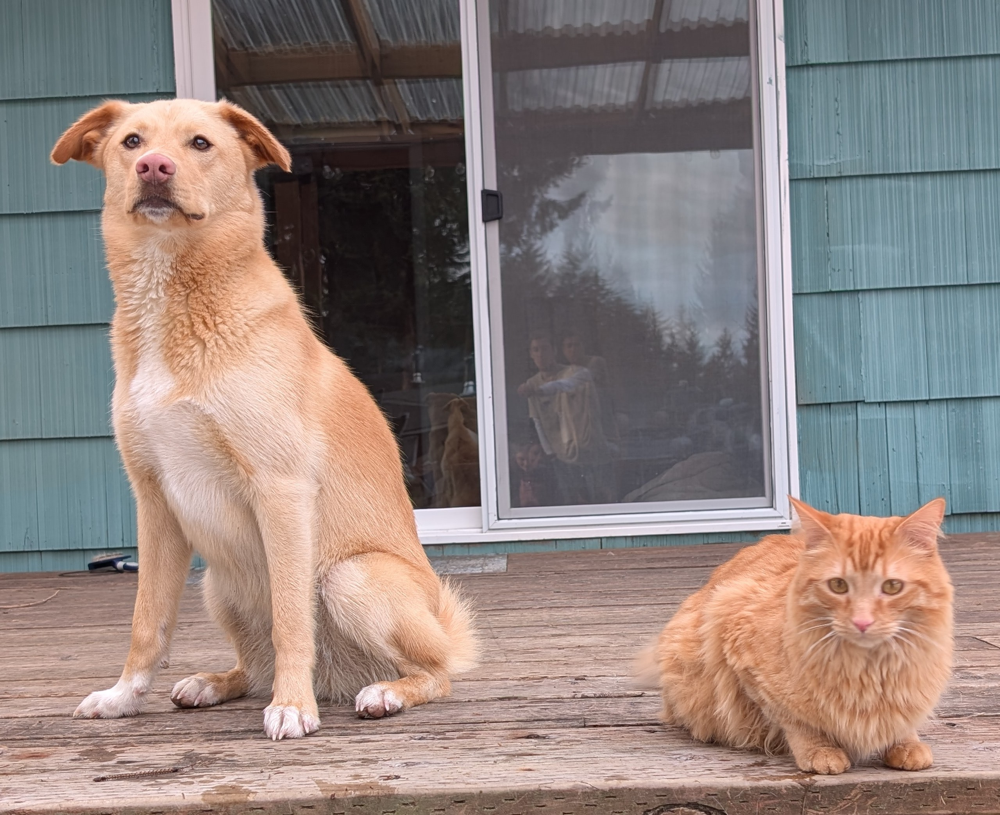

```{r setup, include=FALSE}
knitr::opts_chunk$set(echo = TRUE)
```
# About me
* I love moss, especially when trees look like they're wearing green fuzzy sweaters made of it
* I'm trying to start a book club with my friend, Danielle. If you're reading this, you should join
* My dog and cat are both kinda blonde/reddish so they look actually related to each other and me which cracks me up



